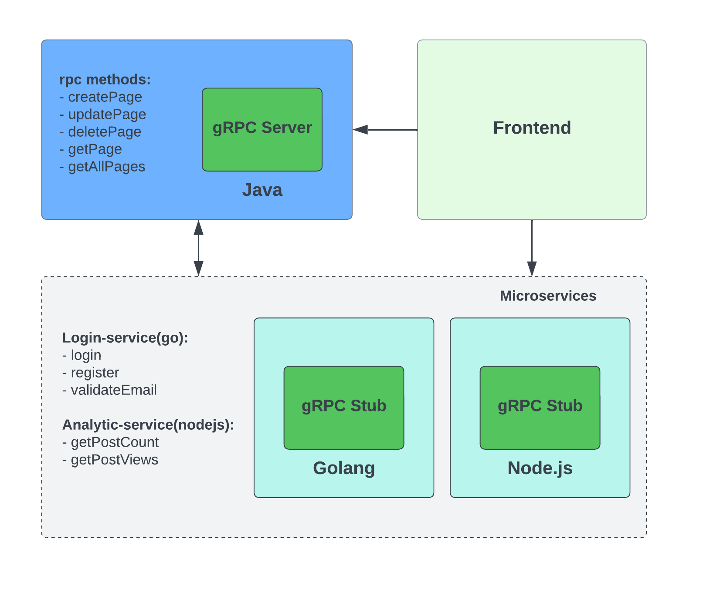

# Aoshima-SEIS-739
Saleban Olow  
Reza Valipour

### Vision Statement

We are planning to develop an easy-to-use content management system (CMS) that would allow website owners to update their content easily. We strive to create a unique and reliable system, making it simple for users to manage their content. We want to empower website owners to update content securely and efficiently. 

### Project Directories & Structure
- <strong>grpc-cms-server-java</strong>: The server side of the project. It is written in Java and uses gRPC for communication.
- <strong>login-service-go</strong>: The login service of the project. It is written in Go and uses gRPC for communication with the server. It's generated using the gRPC-Go plugin.
- <strong>analytic-service-js</strong>: The analytic service of the project. It is written in JavaScript and uses gRPC for communication with the server. It's generated using the gRPC-Node plugin.
- <strong>cms-client-app</strong>: This is the frontend of the project, it's using Nextjs and will be using all the services to provide a complete CMS experience.

### Why gRPC?
gRPC is a modern open source high performance RPC framework that can run in any environment. It can efficiently connect services in and across data centers with pluggable support for load balancing, tracing, health checking and authentication. It is also a flexible framework that can be used in many different environments: from clients to servers to in-process communication between applications. It is also a great tool for microservices architecture.

### Why are we using gRPC?
Our objective was to develop microservices that effectively communicate with each other and using grpc give us the ability to do that. 

#### Advantages of gRPC
- Efficient communication: gRPC provides efficient communication between services, thanks to its use of HTTP/2 and Protocol Buffers. This can lead to better performance and lower resource usage, which is crucial for a CMS that may handle large amounts of data and numerous user interactions.

- Language-agnostic: Since the project consists of services written in different languages (Java, Go, and JavaScript), gRPC's support for multiple languages allows seamless integration and interoperability among these services, regardless of the language they're implemented in.

- Strongly-typed interfaces: gRPC enforces strict schemas for services and messages using Protocol Buffers. This ensures that both the client and server agree on the API contract and data structures, reducing the likelihood of bugs and making communication between services more reliable.

- Scalability: gRPC is designed to work well in distributed systems and microservices architectures. Its features, such as streaming, load balancing, and pluggable components, make it easier to scale the CMS application as the need arises.

- Easier client integration: gRPC provides client libraries for various languages, simplifying the interaction between the frontend application (Next.js in this case) and the services. This streamlines the development process and improves the overall user experience in the CMS.

### How to run the project

I'll dockerize the project and add kubernetes for deployment in the future. Stay tuned!
